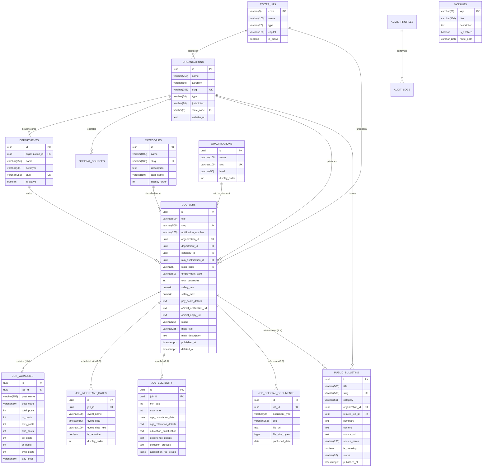

# Database Design & Schema Specification — SuchnaSetu

## 1. Relational Architecture & Normalization

SuchnaSetu implements a **3NF Normalized PostgreSQL Database** in Supabase, structured into two distinct layers:
1. **Core Master Layer**: System-wide taxonomies and master entities shared across all modules (`states_uts`, `organizations`, `departments`, `categories`, `qualifications`, `modules`, `official_sources`, `admin_profiles`, `audit_logs`).
2. **Domain Module Layer**: Isolated table structures for each domain module (e.g. `gov_jobs`, `job_vacancies`, `job_important_dates`, `job_eligibility`, `job_official_documents`, `public_bulletins`).

---

## 2. Entity-Relationship Model (Core & Jobs Module)

---

## 3. Data Integrity & Constraints

1. **Foreign Key Integrity**:
   - `job_vacancies`, `job_important_dates`, `job_eligibility`, and `job_official_documents` cascade on `job_id` deletion (`ON DELETE CASCADE`).
   - `gov_jobs` references master tables (`organizations`, `departments`, `categories`, `qualifications`, `states_uts`).
2. **Soft Deletes**:
   - `gov_jobs.deleted_at` allows moving notices to Trash without losing audit trails or sub-table breakdowns.
3. **Audit Log Trail**:
   - Every mutation is recorded in `audit_logs` with `admin_id`, `action`, `entity_type`, `entity_id`, and `metadata`.
4. **Row Level Security (RLS)**:
   - **Public**: Anonymous `SELECT` permitted only where `status = 'published'` and `deleted_at IS NULL`.
   - **Admin**: Full access granted to authenticated users verified in `admin_profiles` (`is_active = true`).
